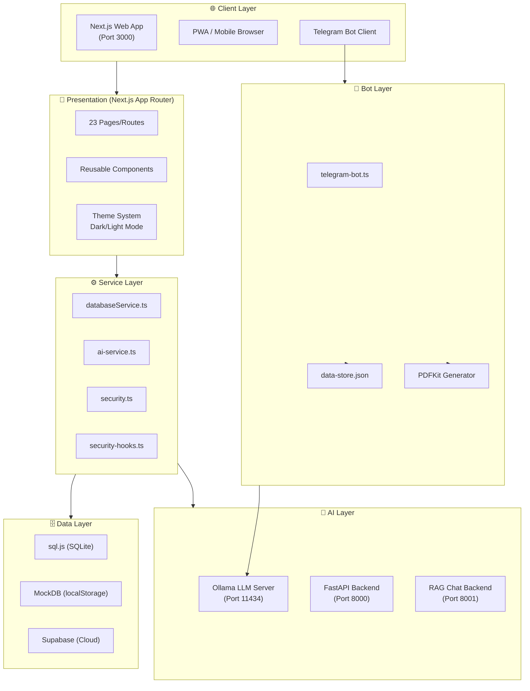
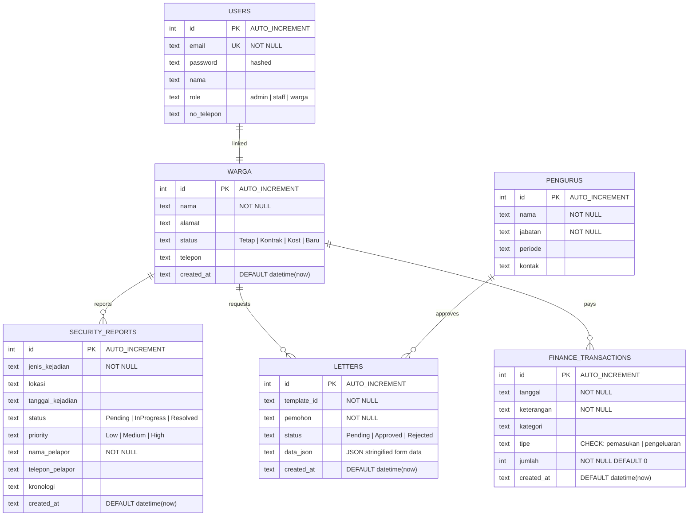

# 🏛️ PRISMA — Platform Informasi & Sistem Manajemen RT 04
## Structured Project Prompt — Full Lifecycle Documentation

> **Dokumen ini adalah prompt terstruktur, detail, dan spesifik** yang mencakup seluruh siklus hidup proyek PRISMA:
> Kerangka → Desain → Build → Develop → Maintain → Security → Database Schema

---

## 📋 Daftar Isi

1. [Gambaran Umum Proyek](#1-gambaran-umum-proyek)
2. [Arsitektur & Kerangka Sistem](#2-arsitektur--kerangka-sistem)
3. [Desain UI/UX Web](#3-desain-uiux-web)
4. [Build & Konfigurasi](#4-build--konfigurasi)
5. [Development Guidelines](#5-development-guidelines)
6. [Maintenance & Operasional](#6-maintenance--operasional)
7. [Security Framework](#7-security-framework)
8. [Database Schema Design](#8-database-schema-design)
9. [API & Service Layer](#9-api--service-layer)
10. [AI & Bot Integration](#10-ai--bot-integration)
11. [Testing Strategy](#11-testing-strategy)
12. [Deployment Pipeline](#12-deployment-pipeline)

---

## 1. Gambaran Umum Proyek

### 1.1 Identitas Proyek

| Atribut | Detail |
|---|---|
| **Nama Proyek** | PRISMA (Platform Informasi & Sistem Manajemen RT 04) |
| **Versi** | 0.1.0 |
| **Repositori** | `github.com/ProgrammingDevelopment/PRISMA` |
| **Domain** | Tata kelola RT/RW digital berbasis AI |
| **Target User** | Warga RT 04/RW 09, Pengurus RT, Staff Administrasi |
| **Lokasi** | Kelurahan Kemayoran, Jakarta Pusat |

### 1.2 Tujuan Proyek

1. **Digitalisasi Administrasi** — Menggantikan proses manual pencatatan warga, surat-menyurat, dan kas RT menjadi digital.
2. **Transparansi Keuangan** — Membuka akses real-time data keuangan kas RT kepada seluruh warga.
3. **Keamanan Lingkungan** — Menyediakan sistem pelaporan insiden terintegrasi dengan notifikasi instan.
4. **Pelayanan AI** — Menghadirkan asisten virtual cerdas (Siaga) via web chatbot dan Telegram bot.
5. **Aksesibilitas** — Dapat diakses dari smartphone (PWA), tablet, dan desktop oleh seluruh lapisan usia warga.

### 1.3 Tech Stack Summary

```
┌─────────────────────────────────────────────────────┐
│                    PRISMA STACK                     │
├──────────────┬──────────────────────────────────────┤
│ Frontend     │ Next.js 16.1.4, React 19, TypeScript │
│ Styling      │ Tailwind CSS v4, PostCSS, Framer Mo. │
│ Component    │ Radix UI Primitives (@radix-ui/*)    │
│ State/Theme  │ next-themes, clsx, tailwind-merge    │
│ Database     │ sql.js (SQLite in-browser), Supabase │
│ AI Frontend  │ @google/generative-ai, Ollama Client │
│ AI Backend   │ Python FastAPI + Ollama LLM          │
│ Bot Engine   │ node-telegram-bot-api + pdfkit       │
│ PWA          │ @serwist/next (Service Worker)       │
│ Testing      │ Vitest + @testing-library/react      │
│ Security     │ bcryptjs, dompurify, xss, sanitize   │
│ Deploy       │ Cloudflare Pages, Vercel             │
│ I18n         │ next-intl (ID, EN, ZH)               │
│ SEO          │ next-sitemap                         │
└──────────────┴──────────────────────────────────────┘
```

---

## 2. Arsitektur & Kerangka Sistem

### 2.1 Arsitektur Diagram



### 2.2 Struktur Direktori

```
prisma/
├── src/
│   ├── app/                          # Next.js App Router (Pages & Routes)
│   │   ├── page.tsx                  # Landing/Dashboard Page
│   │   ├── layout.tsx                # Root Layout + Security Init
│   │   ├── globals.css               # Global Design Tokens (Tailwind v4)
│   │   ├── admin/                    # Admin Panel
│   │   │   ├── page.tsx              # Admin Dashboard
│   │   │   ├── audit/page.tsx        # Audit Log Viewer
│   │   │   ├── files/page.tsx        # File Manager
│   │   │   ├── infrastruktur/page.tsx# Infrastructure Management
│   │   │   └── login/page.tsx        # Admin Login
│   │   ├── auth/                     # Authentication
│   │   │   ├── login/page.tsx        # User Login
│   │   │   └── register/page.tsx     # User Registration
│   │   ├── galeri/page.tsx           # Photo Gallery
│   │   ├── keuangan/                 # Financial Module
│   │   │   ├── laporan/page.tsx      # Financial Reports
│   │   │   ├── iuran/page.tsx        # Monthly Dues
│   │   │   ├── pembayaran/page.tsx   # Payment Processing
│   │   │   ├── custom/page.tsx       # Custom Reports
│   │   │   ├── event-budget/page.tsx # Event Budget
│   │   │   └── share/page.tsx        # Share Reports
│   │   ├── layanan/                  # Service Center
│   │   │   ├── page.tsx              # Service Hub
│   │   │   └── administrasi/page.tsx # Administration Services
│   │   ├── surat/                    # Document Management
│   │   │   ├── page.tsx              # Letter Templates
│   │   │   └── keamanan/page.tsx     # Security Report Form
│   │   ├── profile/page.tsx          # User Profile
│   │   ├── search/page.tsx           # Search Page
│   │   ├── settings/database/page.tsx# Database Settings
│   │   ├── telegram-webapp/page.tsx  # Telegram WebApp View
│   │   ├── sw.ts                     # Service Worker (Serwist)
│   │   └── manifest.ts              # PWA Manifest
│   ├── components/                   # Reusable UI Components
│   │   ├── chat/chatbot.tsx          # AI Chatbot Widget (Floating)
│   │   ├── home/                     # Landing Page Components
│   │   ├── layout/                   # Navbar, Sidebar, Footer
│   │   ├── surat/                    # Letter Form Components
│   │   ├── ui/                       # Radix UI Primitives
│   │   ├── pwa-install-prompt.tsx    # PWA Install Banner
│   │   ├── theme-provider.tsx        # Dark/Light Mode Provider
│   │   ├── theme-toggle.tsx          # Theme Switch Button
│   │   └── whatsapp-direct.tsx       # WhatsApp Integration
│   ├── Services/                     # Business Logic Services
│   │   ├── databaseService.ts        # Central DB API (SQLite + MockDB)
│   │   ├── aiService.ts              # AI Backend Client
│   │   ├── dataService.ts            # Data Transformation
│   │   └── nlpService.ts             # NLP Processing Client
│   ├── lib/                          # Core Library
│   │   ├── security.ts               # OWASP Security Core (567 lines)
│   │   ├── security-hooks.ts         # React Security Hooks (346 lines)
│   │   ├── sqliteDB.ts               # SQLite In-Browser Engine
│   │   ├── mockDatabase.ts           # Mock/Seed Data Fallback
│   │   ├── ai-service.ts             # Ollama AI Client
│   │   ├── demo-credentials.ts       # Demo Auth Credentials
│   │   ├── financial-utils.ts        # Financial Calculations
│   │   ├── performance.ts            # Performance Monitoring
│   │   └── strategic-recommendations.ts # AI Recommendations
│   ├── hooks/                        # Custom React Hooks
│   │   ├── useSafeNavigation.ts      # Safe Navigation Hook
│   │   └── use-click-outside.ts      # Click Outside Detection
│   └── config/
│       └── apiConfig.ts              # API URL Configuration
├── scripts/                          # Background Scripts
│   ├── telegram-bot.ts               # Telegram Bot Engine (787 lines)
│   ├── generate_db.js                # SQLite DB Seeder
│   ├── data-store.json               # Bot Real-Time Data Store
│   └── bot-runner.ps1                # Bot Startup Script
├── public/                           # Static Assets
├── messages/                         # i18n Translation Files
├── types/                            # TypeScript Type Definitions
├── next.config.ts                    # Next.js Configuration
├── vitest.config.ts                  # Test Configuration
├── tsconfig.json                     # TypeScript Configuration
├── wrangler.json                     # Cloudflare Pages Config
├── vercel.json                       # Vercel Config
└── prisma_demo.db                    # SQLite Demo Database File
```

### 2.3 Layer Architecture

| Layer | Tanggung Jawab | File Utama |
|---|---|---|
| **Presentation** | UI rendering, routing, theme | `src/app/**/*.tsx`, `src/components/**` |
| **Hook** | State management, side effects | `src/hooks/*`, `src/lib/security-hooks.ts` |
| **Service** | Business logic, API orchestration | `src/Services/*` |
| **Data Access** | Database CRUD, query engine | `src/lib/sqliteDB.ts`, `src/lib/mockDatabase.ts` |
| **Security** | Auth, encryption, sanitization | `src/lib/security.ts` |
| **AI/Bot** | LLM integration, bot commands | `src/lib/ai-service.ts`, `scripts/telegram-bot.ts` |

---

## 3. Desain UI/UX Web

### 3.1 Design System

```
┌─────────────────────────────────────────────────────┐
│                  DESIGN SYSTEM                      │
├──────────────┬──────────────────────────────────────┤
│ Framework    │ Tailwind CSS v4 (utility-first)      │
│ Components   │ Radix UI Primitives (A11y)           │
│ Animations   │ Framer Motion (fluid transitions)    │
│ Theming      │ next-themes (Dark/Light auto)        │
│ Icons        │ Lucide React + React Icons           │
│ Typography   │ System fonts, Inter (Google Fonts)   │
│ Approach     │ Mobile-First Responsive              │
└──────────────┴──────────────────────────────────────┘
```

### 3.2 Color Palette & Theming

```css
/* Light Mode — Warm Professional */
--primary:        #0f172a   /* Slate 900 (Headers, Nav) */
--primary-accent: #1e40af   /* Blue 800 (CTA, Links) */
--surface:        #ffffff   /* White (Cards, Panels) */
--background:     #f8fafc   /* Slate 50 (Page BG) */
--success:        #16a34a   /* Green 600 */
--warning:        #f59e0b   /* Amber 500 */
--danger:         #dc2626   /* Red 600 */
--text-primary:   #1e293b   /* Slate 800 */
--text-secondary: #64748b   /* Slate 500 */

/* Dark Mode — Deep Professional */
--primary:        #e2e8f0   /* Slate 200 (Headers) */
--primary-accent: #60a5fa   /* Blue 400 */
--surface:        #1e293b   /* Slate 800 (Cards) */
--background:     #0f172a   /* Slate 900 (Page BG) */
```

### 3.3 Layout Structure

```
┌──────────────────────────────────────────────────┐
│ [≡ NAVBAR] 🏠 PRISMA RT 04  [🔍] [🌙/☀️] [👤] │
├──────────────────────────────────────────────────┤
│                                                  │
│  ┌─ MAIN CONTENT ──────────────────────────────┐ │
│  │                                              │ │
│  │  📊 Dashboard / Page Content                 │ │
│  │  ┌──────┐ ┌──────┐ ┌──────┐ ┌──────┐       │ │
│  │  │Stat 1│ │Stat 2│ │Stat 3│ │Stat 4│       │ │
│  │  └──────┘ └──────┘ └──────┘ └──────┘       │ │
│  │                                              │ │
│  │  ┌──── Feature Cards Grid ───────────────┐  │ │
│  │  │ 💰 Keuangan │ 📝 Surat  │ 🚨 Keamanan│  │ │
│  │  │ 👥 Warga    │ 📢 Info   │ ⚙️ Pengaturan│ │ │
│  │  └────────────────────────────────────────┘  │ │
│  │                                              │ │
│  └──────────────────────────────────────────────┘ │
│                                                  │
│  ┌─ FLOATING CHATBOT ─┐                         │
│  │ 🤖 Siaga          │                         │
│  │ Tanya saya!       │                         │
│  └────────────────────┘                         │
├──────────────────────────────────────────────────┤
│ [FOOTER] © PRISMA RT 04 • Links • Contacts      │
└──────────────────────────────────────────────────┘
```

### 3.4 Halaman/Route Map

| # | Route | Fungsi | Akses |
|---|---|---|---|
| 1 | `/` | Landing/Dashboard utama | Public |
| 2 | `/auth/login` | Login warga | Public |
| 3 | `/auth/register` | Registrasi warga baru | Public |
| 4 | `/admin` | Panel admin dashboard | Admin |
| 5 | `/admin/login` | Login admin | Public |
| 6 | `/admin/audit` | Audit log viewer | Admin |
| 7 | `/admin/files` | File management | Admin |
| 8 | `/admin/infrastruktur` | Infrastruktur RT | Admin |
| 9 | `/keuangan/laporan` | Laporan keuangan bulanan | Warga |
| 10 | `/keuangan/iuran` | Status iuran warga | Warga |
| 11 | `/keuangan/pembayaran` | Proses pembayaran | Warga |
| 12 | `/keuangan/custom` | Custom financial report | Admin |
| 13 | `/keuangan/event-budget` | Anggaran event RT | Admin |
| 14 | `/keuangan/share` | Share laporan keuangan | Warga |
| 15 | `/layanan` | Hub layanan mandiri | Warga |
| 16 | `/layanan/administrasi` | Administrasi kependudukan | Warga |
| 17 | `/surat` | Template surat RT | Warga |
| 18 | `/surat/keamanan` | Form lapor keamanan | Warga |
| 19 | `/galeri` | Galeri foto RT | Public |
| 20 | `/profile` | Profil pengguna | Warga |
| 21 | `/search` | Pencarian global | Warga |
| 22 | `/settings/database` | Pengaturan database | Admin |
| 23 | `/telegram-webapp` | Telegram WebApp view | Public |

### 3.5 Komponen Reusable

| Komponen | Lokasi | Fungsi |
|---|---|---|
| `chatbot.tsx` | `components/chat/` | Floating AI chatbot widget |
| `pwa-install-prompt.tsx` | `components/` | Banner install PWA |
| `theme-provider.tsx` | `components/` | Dark/Light mode context |
| `theme-toggle.tsx` | `components/` | Toggle switch tema |
| `whatsapp-direct.tsx` | `components/` | Quick WA action button |
| `ui/*` | `components/ui/` | Button, Card, Input, Dialog, Accordion, etc. |

---

## 4. Build & Konfigurasi

### 4.1 Next.js Configuration

```typescript
// next.config.ts — Key Settings
{
  output: 'export',          // Static HTML Export (SSG)
  images: { unoptimized: true },
  trailingSlash: true,       // URL compatibility
  compress: true,            // Gzip compression
  poweredByHeader: false,    // Remove X-Powered-By (security)
  turbopack: {},             // Turbopack engine
  logging: { fetches: { fullUrl: true } }
}
// + @serwist/next PWA wrapper (Service Worker)
```

### 4.2 Build Scripts

| Script | Perintah | Fungsi |
|---|---|---|
| `dev` | `next dev` | Development server (port 3000) |
| `build` | `next build` | Production build + static export |
| `start` | `next start` | Production server |
| `lint` | `eslint` | Code linting |
| `test` | `vitest run` | Run unit tests |
| `test:watch` | `vitest` | Watch mode testing |
| `test:ci` | `vitest run --reporter=verbose` | CI verbose tests |
| `deploy:cf` | `npm run build && npx wrangler pages deploy out` | Cloudflare Pages deploy |
| `bot` | `ts-node ... scripts/telegram-bot.ts` | Start Telegram bot |

### 4.3 Environment Variables

```bash
# .env.local — Web Application
NEXT_PUBLIC_AI_BACKEND_URL="http://localhost:8000"    # FastAPI AI Backend
NEXT_PUBLIC_CHAT_API_URL="http://localhost:8001/chat" # RAG Chat Backend
DB_HOST=localhost                                      # Legacy MySQL fallback
DB_PORT=3306
DB_NAME=admin_rt

# .env.bot — Telegram Bot
TELEGRAM_BOT_TOKEN=<bot-token>                        # Bot @mayoran04Bot
OLLAMA_API_URL=http://localhost:11434/api/chat         # Ollama LLM endpoint
OLLAMA_MODEL=                         # Primary AI model
OLLAMA_API_KEY=<api-key>                              # API key (if needed)
ADMIN_CHAT_ID=<telegram-chat-id>                      # Admin notification target
NEXT_PUBLIC_AI_BACKEND_URL=http://localhost:3000       # Website monitoring URL
```

---

## 5. Development Guidelines

### 5.1 Coding Standards

| Aspek | Standar |
|---|---|
| **Language** | TypeScript strict mode |
| **Naming** | camelCase (vars/functions), PascalCase (components/types) |
| **Components** | Functional components + hooks only |
| **Imports** | Absolute paths via `@/` alias |
| **State** | React hooks (`useState`, `useCallback`, `useEffect`) |
| **Side Effects** | Custom hooks pattern (e.g., `useSecureAuth`) |
| **Styling** | Tailwind utility classes, `clsx()` for conditionals |
| **Sanitization** | ALL user input MUST pass through `sanitizeInput()` |
| **Error Handling** | try/catch with `logSecurityEvent()` |

### 5.2 Component Development Pattern

```typescript
// Template: Server-safe Client Component
"use client"

import { useState, useCallback } from 'react'
import { sanitizeInput } from '@/lib/security'
import { Button } from '@/components/ui/button'

interface Props {
  // Always define explicit interfaces
}

export function FeatureComponent({ ...props }: Props) {
  const [data, setData] = useState<Type>(initial)

  const handleAction = useCallback(async () => {
    const sanitized = sanitizeInput(rawInput) // ALWAYS sanitize
    // ... business logic
  }, [dependencies])

  return (
    <div className="space-y-4">
      {/* Mobile-first responsive layout */}
    </div>
  )
}
```

### 5.3 Data Flow Pattern

```
User Input → sanitizeInput() → Service Layer → Database Layer → Response
     │                              │
     └── checkRateLimit() ──────────┘
     └── logSecurityEvent() ────────┘
```

---

## 6. Maintenance & Operasional

### 6.1 Monitoring Checklist

| Item | Tool | Frekuensi |
|---|---|---|
| Website uptime | Telegram Bot auto-ping (5 min interval) | Real-time |
| Bot status | `/status` command | On-demand |
| Security audit log | `getAuditLog()` + Admin panel | Harian |
| Database size | Settings > Database page | Mingguan |
| Dependency updates | `npm audit` | Bulanan |
| SSL certificate | Cloudflare/Vercel auto-managed | Otomatis |

### 6.2 Backup Strategy

| Data | Metode | Lokasi Backup |
|---|---|---|
| SQLite Database | `SqliteDB.exportDB()` → download `.db` file | Manual download |
| data-store.json | Git version control | GitHub repository |
| Environment vars | Terpisah dari repo (`.gitignore`) | Secure vault |
| User uploads | Cloudflare/Vercel CDN | CDN edge nodes |

### 6.3 Performance Targets

| Metrik | Target | Cara Pencapaian |
|---|---|---|
| First Contentful Paint | < 1.5s | SSG + Turbopack |
| Time to Interactive | < 3s | Code splitting, lazy load |
| Lighthouse Score | > 90 | PWA, compression, semantic HTML |
| API Response Time | < 200ms | SQLite in-memory, debounced save |
| Bot Response Time | < 5s | Ollama streaming, fallback model |

### 6.4 Scaling Plan

```
Level 1 (Current): Monolith SSG + Client SQLite
   ↓
Level 2: Supabase Cloud DB + Edge Functions
   ↓
Level 3: Microservices (Next.js + FastAPI + RAG separated)
   ↓
Level 4: Kubernetes orchestration + dedicated ML serving
```

---

## 7. Security Framework

### 7.1 OWASP Top 10 Coverage

| OWASP | Implementasi di PRISMA | File |
|---|---|---|
| **A01: Broken Access Control** | Role-based auth (`admin/staff/warga`), session fingerprinting | `security.ts` |
| **A02: Cryptographic Failures** | XOR encryption (demo) + bcryptjs hashing, runtime key derivation | `security.ts` |
| **A03: Injection** | `sanitizeInput()` — multi-layer XSS/SQL inject strip, `dompurify`, `xss` lib | `security.ts` |
| **A05: Security Misconfiguration** | `poweredByHeader: false`, console suppression in prod | `next.config.ts` |
| **A07: Auth Failures** | Rate limiting (5 login/min, 5 min block), password strength validator | `security.ts` |
| **A08: Data Integrity** | CSRF token management (`generateCSRFToken`, `validateCSRFToken`) | `security.ts` |
| **A09: Logging Failures** | Audit log system (`logSecurityEvent()`, max 1000 entries) | `security.ts` |

### 7.2 Security Module Map

```
┌─────────────────────────────────────────────────────────┐
│                  security.ts (Core)                     │
├─────────────────────────────────────────────────────────┤
│ ✅ encryptData() / decryptData()   — XOR + Base64      │
│ ✅ secureStorage                    — Encrypted session  │
│ ✅ generateFingerprint()            — Browser-based      │
│ ✅ sanitizeInput() / sanitizeObject()— Multi-layer clean │
│ ✅ checkRateLimit() / resetRateLimit()                   │
│ ✅ maskPhoneNumber/Email/NIK/Name   — PII masking        │
│ ✅ storeCredentials/getCredentials  — Secure session      │
│ ✅ generateCSRFToken/validateCSRF   — Anti-CSRF          │
│ ✅ secureFetch()                    — Protected HTTP      │
│ ✅ validatePasswordStrength()       — Password scoring    │
│ ✅ logSecurityEvent() / getAuditLog()— Audit trail       │
│ ✅ initSecurityProtections()         — Anti-clickjack     │
└─────────────────────────────────────────────────────────┘

┌─────────────────────────────────────────────────────────┐
│              security-hooks.ts (React)                  │
├─────────────────────────────────────────────────────────┤
│ ✅ useSecureAuth()      — Login/logout + rate limit     │
│ ✅ useDataMasking()     — Toggle sensitive data display │
│ ✅ useSecureForm()      — Auto-sanitize form inputs     │
│ ✅ useSecureApi()       — Protected API calls           │
│ ✅ usePasswordStrength()— Real-time password scoring    │
│ ✅ useSecureStorage()   — Encrypted localStorage hook   │
└─────────────────────────────────────────────────────────┘
```

### 7.3 Bot Security (Telegram)

| Perlindungan | Implementasi |
|---|---|
| Input Sanitization | `sanitizeBotInput()` — strip `<script>`, event handlers, `javascript:`, null bytes |
| Rate Limiting | 30 messages/min/user, sliding window |
| Input Length Limit | Max 500 characters |
| Admin Authorization | `ADMIN_CHAT_ID` check for `/broadcast` command |
| Token Isolation | `.env.bot` excluded from git |
| Graceful Shutdown | `SIGINT/SIGTERM` handler saves stats before exit |

### 7.4 Security Best Practices Prompt

> **Saat berinteraksi dengan AI untuk security:**
> - Selalu validasi SETIAP input user melalui `sanitizeInput()`
> - Gunakan `checkRateLimit()` sebelum operasi sensitif
> - Pasang `logSecurityEvent()` pada setiap aksi auth dan form submit
> - Jangan pernah simpan credential dalam bentuk plaintext
> - Gunakan `secureStorage` (bukan `localStorage` langsung)
> - Mask semua PII (telepon, email, NIK) di tampilan publik
> - Validasi CSRF token pada setiap mutating request

---

## 8. Database Schema Design

### 8.1 Database Tiers

```
┌────────────────────────────────────────────────────┐
│                DATABASE ARCHITECTURE               │
├────────────────────────────────────────────────────┤
│                                                    │
│  Tier 1: Client-Side SQLite (sql.js)               │
│  ├── In-browser via WebAssembly                    │
│  ├── Persisted in localStorage (base64)            │
│  └── Zero server dependency                        │
│                                                    │
│  Tier 2: Mock Database (localStorage JSON)         │
│  ├── Fallback for non-migrated entities            │
│  └── Seed data for demo mode                       │
│                                                    │
│  Tier 3: Cloud Database (Supabase/PostgreSQL)      │
│  ├── Production-ready                              │
│  └── Drizzle ORM integration (branch)              │
│                                                    │
│  Tier 4: Legacy MySQL (XAMPP)                      │
│  └── Community hosting fallback                    │
│                                                    │
└────────────────────────────────────────────────────┘
```

### 8.2 Entity Relationship Diagram (ERD)



### 8.3 Table Definitions (SQLite DDL)

#### Table: `users`
```sql
CREATE TABLE IF NOT EXISTS users (
    id          INTEGER PRIMARY KEY AUTOINCREMENT,
    email       TEXT UNIQUE,
    password    TEXT,           -- bcrypt hashed
    nama        TEXT,
    role        TEXT,           -- 'admin' | 'staff' | 'warga'
    no_telepon  TEXT
);
```

#### Table: `warga`
```sql
CREATE TABLE IF NOT EXISTS warga (
    id          INTEGER PRIMARY KEY AUTOINCREMENT,
    nama        TEXT NOT NULL,
    alamat      TEXT,
    status      TEXT DEFAULT 'Baru',  -- 'Tetap' | 'Kontrak' | 'Kost' | 'Baru'
    telepon     TEXT,
    created_at  TEXT DEFAULT (datetime('now'))
);

-- Indexes
CREATE INDEX IF NOT EXISTS idx_warga_nama   ON warga(nama);
CREATE INDEX IF NOT EXISTS idx_warga_status ON warga(status);
```

#### Table: `pengurus`
```sql
CREATE TABLE IF NOT EXISTS pengurus (
    id       INTEGER PRIMARY KEY AUTOINCREMENT,
    nama     TEXT NOT NULL,
    jabatan  TEXT NOT NULL,
    periode  TEXT,
    kontak   TEXT
);
```

#### Table: `security_reports`
```sql
CREATE TABLE IF NOT EXISTS security_reports (
    id                INTEGER PRIMARY KEY AUTOINCREMENT,
    jenis_kejadian    TEXT NOT NULL,
    lokasi            TEXT,
    tanggal_kejadian  TEXT,
    status            TEXT DEFAULT 'Pending',   -- 'Pending' | 'InProgress' | 'Resolved'
    priority          TEXT DEFAULT 'Medium',    -- 'Low' | 'Medium' | 'High'
    nama_pelapor      TEXT NOT NULL,
    telepon_pelapor   TEXT,
    kronologi         TEXT,
    created_at        TEXT DEFAULT (datetime('now'))
);

-- Indexes
CREATE INDEX IF NOT EXISTS idx_security_status   ON security_reports(status);
CREATE INDEX IF NOT EXISTS idx_security_priority ON security_reports(priority);
CREATE INDEX IF NOT EXISTS idx_security_date     ON security_reports(tanggal_kejadian);
```

#### Table: `finance_transactions`
```sql
CREATE TABLE IF NOT EXISTS finance_transactions (
    id          INTEGER PRIMARY KEY AUTOINCREMENT,
    tanggal     TEXT NOT NULL,
    keterangan  TEXT NOT NULL,
    kategori    TEXT,
    tipe        TEXT CHECK(tipe IN ('pemasukan', 'pengeluaran')) NOT NULL,
    jumlah      INTEGER NOT NULL DEFAULT 0,
    created_at  TEXT DEFAULT (datetime('now'))
);

-- Indexes
CREATE INDEX IF NOT EXISTS idx_finance_tipe    ON finance_transactions(tipe);
CREATE INDEX IF NOT EXISTS idx_finance_tanggal ON finance_transactions(tanggal);
```

#### Table: `letters`
```sql
CREATE TABLE IF NOT EXISTS letters (
    id           INTEGER PRIMARY KEY AUTOINCREMENT,
    template_id  TEXT NOT NULL,
    pemohon      TEXT NOT NULL,
    status       TEXT DEFAULT 'Pending',  -- 'Pending' | 'Approved' | 'Rejected'
    data_json    TEXT,                    -- JSON stringified form data
    created_at   TEXT DEFAULT (datetime('now'))
);

-- Indexes
CREATE INDEX IF NOT EXISTS idx_letters_status ON letters(status);
```

### 8.4 Database Index Map

| Table | Index | Kolom | Tujuan |
|---|---|---|---|
| `warga` | `idx_warga_nama` | `nama` | Pencarian warga by nama |
| `warga` | `idx_warga_status` | `status` | Filter berdasarkan status tinggal |
| `security_reports` | `idx_security_status` | `status` | Filter laporan pending/resolved |
| `security_reports` | `idx_security_priority` | `priority` | Sort by prioritas |
| `security_reports` | `idx_security_date` | `tanggal_kejadian` | Range query tanggal |
| `finance_transactions` | `idx_finance_tipe` | `tipe` | Filter pemasukan/pengeluaran |
| `finance_transactions` | `idx_finance_tanggal` | `tanggal` | Range query periode |
| `letters` | `idx_letters_status` | `status` | Filter status pengajuan surat |

### 8.5 TypeScript Data Interfaces

```typescript
// Core Data Types (from databaseService.ts)
interface WargaData {
    id: number;
    nama: string;
    alamat: string;
    status: string;           // 'Tetap' | 'Kontrak' | 'Kost' | 'Baru'
    telepon: string;
}

interface PengurusData {
    id: number;
    nama: string;
    jabatan: string;
    periode: string;
}

interface StatistikData {
    totalWarga: number;
    totalKK: number;
    wargaAktif: number;
    pendatangBaru: number;
}

interface LetterTemplate {
    id: string;
    title: string;
    description: string;
    category: string;         // 'Administrasi' | 'Kependudukan'
    files: { docx: string; pdf: string };
    requiredFields: string[];
}

interface Transaction {
    id: string;
    tanggal: string;
    keterangan: string;
    kategori: string;
    tipe: 'pemasukan' | 'pengeluaran';
    jumlah: number;
}

interface MonthlyReport {
    bulan: string;
    tahun: number;
    saldo_awal: number;
    total_pemasukan: number;
    total_pengeluaran: number;
    saldo_akhir: number;
    transaksi: Transaction[];
}

interface SecurityReportSubmission {
    kronologi: string;
    tanggal_kejadian: string;
    waktu_kejadian?: string;
    lokasi?: string;
    nama_pelapor: string;
    telepon_pelapor: string;
    jenis_kejadian: string;
}

interface SecureCredentials {
    userId: string;
    role: 'admin' | 'staff' | 'warga';
    sessionToken: string;
    expiresAt: number;
}
```

---

## 9. API & Service Layer

### 9.1 Internal Service API (databaseService.ts)

| Method | Return Type | Sumber Data |
|---|---|---|
| `getAdministrationData(type?)` | `AdministrationData` | SQLite + MockDB |
| `addWarga(data)` | `{success, message}` | SQLite |
| `getLetterTemplates(category?)` | `LetterTemplate[]` | MockDB |
| `getLetterTemplate(id)` | `LetterTemplate \| null` | MockDB |
| `submitLetterRequest(id, data)` | `{success, submissionId}` | MockDB |
| `getCurrentBalance()` | `{saldo, lastUpdate}` | MockDB |
| `getMonthlyReports()` | `MonthlyReport[]` | MockDB |
| `getExpenseSummary()` | `ExpenseSummary` | MockDB |
| `getIncidentTypes()` | `IncidentType[]` | Hardcoded |
| `getSecurityStats()` | `{total, pending, resolved}` | SQLite |
| `getRecentSecurityReports()` | `SecurityReport[]` | SQLite |
| `submitSecurityReport(report)` | `{success, reportId}` | SQLite |

### 9.2 AI Backend API (FastAPI Port 8000)

| Endpoint | Method | Fungsi |
|---|---|---|
| `/docs` | GET | Swagger documentation |
| `/api/v1/nlp/sentiment` | POST | Sentiment analysis |
| `/api/v1/nlp/chat` | POST | AI chat |
| `/api/v1/vision/classify` | POST | Image classification |
| `/api/v1/predict/financial` | POST | Financial prediction |
| `/api/v1/recommend/activities/{id}` | GET | Activity recommendations |

### 9.3 Chat API (RAG Backend Port 8001)

| Endpoint | Method | Fungsi |
|---|---|---|
| `/chat` | POST | RAG-based chat with Siaga assistant |

---

## 10. AI & Bot Integration

### 10.1 AI Architecture

```
┌────────────────────────────────────┐
│        AI Service Flow             │
├────────────────────────────────────┤
│                                    │
│  Web Chatbot (chatbot.tsx)         │
│       │                            │
│       ├──→ /api/chat (Next.js)     │
│       │       │                    │
│       │       └──→ Ollama LLM      │
│       │             (Streaming)    │
│       │                            │
│       └──→ Mock Fallback           │
│             (keyword matching)     │
│                                    │
│  Telegram Bot (telegram-bot.ts)    │
│       │                            │
│       ├──→ Ollama API (Primary)    │
│       │    Model: kimi-k2.5:cloud  │
│       │                            │
│       ├──→ Ollama API (Fallback)   │
│       │    Model: llama3.2:1b      │
│       │                            │
│       └──→ Menu-based (Offline)    │
│                                    │
└────────────────────────────────────┘
```

### 10.2 Telegram Bot Commands

| Command | Fungsi |
|---|---|
| `/start` | Welcome + tampilkan main menu |
| `/help` | Daftar perintah tersedia |
| `/register` | Registrasi warga baru (→ PDF) |
| `/report` | Laporan keamanan (→ PDF) |
| `/finance` | Ringkasan kas RT real-time |
| `/contact` | Kontak darurat pengurus |
| `/subscribe` | Toggle notifikasi pengumuman |
| `/status` | Status sistem bot (uptime, memory, AI status) |
| `/broadcast [msg]` | (Admin only) Broadcast ke seluruh subscriber |
| *Free text* | AI Chat (Ollama) dengan konteks data RT |

### 10.3 Bot Features

- **Real-time data** — Baca `data-store.json` setiap query
- **AI Contextual Chat** — System prompt berisi data RT terbaru
- **PDF Auto-Generation** — Surat pengantar, laporan keamanan, registrasi
- **Broadcast System** — Admin push notification ke semua subscriber
- **Website Monitoring** — Ping website setiap 5 menit, alert admin jika down
- **Chat History** — Per-user message history (max 10 messages)
- **Dual Model** — Primary (cloud) + Fallback (local) AI model

---

## 11. Testing Strategy

### 11.1 Test Configuration

```typescript
// vitest.config.ts
{
  test: {
    environment: 'jsdom',
    globals: true,
    include: ['src/**/*.test.{ts,tsx}']
  }
}
```

### 11.2 Test Coverage Areas

| Area | File Test | Cakupan |
|---|---|---|
| **Security** | `security.test.ts` (14.6 KB) | XSS sanitization, rate limiting, encryption, masking |
| **Credentials** | `demo-credentials.test.ts` (6.7 KB) | Auth flow, session management |
| **Finance** | `financial-utils.test.ts` (1.5 KB) | Financial calculations |

### 11.3 Test Commands

```bash
npm test              # Run all tests once
npm run test:watch    # Watch mode (auto-rerun)
npm run test:ci       # CI/CD mode (verbose output)
```

---

## 12. Deployment Pipeline

### 12.1 Deployment Targets

| Platform | Config | URL Pattern |
|---|---|---|
| **Cloudflare Pages** | `wrangler.json` | `prisma-rt04.pages.dev` |
| **Vercel** | `vercel.json` | Auto-assigned `.vercel.app` |

### 12.2 Build & Deploy Flow

```
┌─────────────────────────────────────────────────────┐
│               DEPLOYMENT PIPELINE                   │
├─────────────────────────────────────────────────────┤
│                                                     │
│  1. Code Push → GitHub                              │
│       │                                             │
│  2. CI: GitHub Actions                              │
│       ├── npm ci                                    │
│       ├── npm run lint                              │
│       ├── npm run test:ci                           │
│       └── npm run build                             │
│       │                                             │
│  3. Static Export (output: 'export')                │
│       │    → ./out/ directory                       │
│       │                                             │
│  4a. Cloudflare Pages                               │
│       └── wrangler pages deploy out                 │
│           --project-name=prisma-rt04                │
│                                                     │
│  4b. Vercel (Alternative)                           │
│       └── Automatic via vercel.json                 │
│                                                     │
└─────────────────────────────────────────────────────┘
```

### 12.3 Pre-Deploy Checklist

- [ ] Semua test passing (`npm test`)
- [ ] Lint clean (`npm run lint`)
- [ ] Build berhasil (`npm run build`)
- [ ] Environment variables terset di platform
- [ ] Security headers terkonfigurasi
- [ ] PWA Service Worker terbuild
- [ ] Static assets teroptimasi

---

## Ringkasan Prompt Cepat

> **Gunakan prompt ini saat membangun/memodifikasi PRISMA:**
>
> "Kamu sedang mengembangkan **PRISMA**, platform manajemen RT berbasis Next.js 16 + React 19 + TypeScript + Tailwind CSS v4. Arsitektur menggunakan static export (SSG) dengan client-side SQLite (sql.js). Setiap input user WAJIB melalui `sanitizeInput()`. Gunakan Radix UI untuk komponen, Framer Motion untuk animasi, dan `next-themes` untuk dark mode. Database menggunakan 6 tabel: `users`, `warga`, `pengurus`, `security_reports`, `finance_transactions`, `letters` — semua dengan indexes yang terotopimasi. Security library terintegrasi OWASP (XSS prevention, rate limiting, CSRF, encryption, audit log). Telegram bot otonom terintegrasi Ollama AI dengan PDF auto-generation. Deploy ke Cloudflare Pages via static export."

---

*📅 Dibuat: 22 Maret 2026 | PRISMA v0.1.0*
