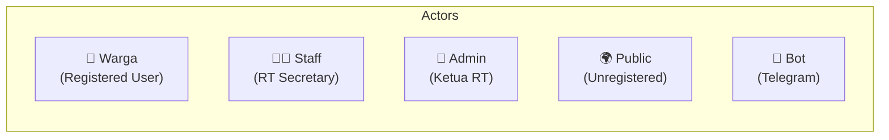
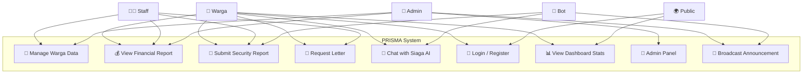

# 📋 Software Requirements Specification (SRS)
## PRISMA — Platform Informasi & Sistem Manajemen RT 04
### SDLC Fase 1: Requirements Analysis

**Versi Dokumen:** 1.0  
**Tanggal:** 10 April 2026  
**Status:** Approved  

---

## 1. Pendahuluan

### 1.1 Tujuan Dokumen
Dokumen ini mendefinisikan kebutuhan fungsional dan non-fungsional untuk sistem PRISMA — platform manajemen digital RT 04/RW 09 Kemayoran, Jakarta Pusat.

### 1.2 Ruang Lingkup
PRISMA mencakup 6 domain utama:
1. **Administrasi Warga** — Pengelolaan data kependudukan
2. **Keuangan RT** — Transparansi kas dan iuran bulanan
3. **Keamanan Lingkungan** — Pelaporan dan monitoring insiden
4. **Surat Menyurat** — Template dan pengajuan surat RT
5. **AI & Bot** — Asisten virtual Siaga (Web + Telegram)
6. **Autentikasi** — Login multi-role (Admin, Staff, Warga)

### 1.3 Definisi & Akronim

| Akronim | Definisi |
|---------|----------|
| PRISMA | Platform Realisasi Informasi, Sistem Manajemen & Administrasi |
| RT | Rukun Tetangga |
| RW | Rukun Warga |
| PWA | Progressive Web Application |
| SSG | Static Site Generation |
| MVVM | Model-View-ViewModel |
| SRS | Software Requirements Specification |

---

## 2. Deskripsi Umum Sistem

### 2.1 Perspektif Produk
PRISMA adalah sistem web-based yang menggabungkan:
- **Frontend SSG** (Next.js 16 + React 19) sebagai antarmuka pengguna
- **Microservices Backend** (Express.js) sebagai service layer terpisah
- **AI Integration** (Ollama LLM + Google Gemini) untuk chatbot cerdas
- **Telegram Bot** untuk akses via messaging platform

### 2.2 Arsitektur Pattern
- **MVVM (Model-View-ViewModel)** untuk frontend client-side
- **Microservices Architecture** untuk backend services
- **Repository Pattern** untuk data access abstraction

### 2.3 Aktor / Pengguna

| Aktor | Deskripsi | Hak Akses |
|-------|-----------|-----------|
| **Public** | Pengunjung tanpa login | Lihat landing page, info umum, galeri |
| **Warga** | Warga terdaftar RT 04 | Semua fitur warga: keuangan, surat, laporan |
| **Staff** | Sekretaris / Bendahara RT | Input data, verifikasi surat, manage keuangan |
| **Admin** | Ketua RT | Full access + audit log + broadcast |
| **Bot** | Sistem Telegram otomatis | Baca data, generate PDF, broadcast |

---

## 3. Kebutuhan Fungsional (Functional Requirements)

### FR-01: Modul Administrasi Warga

| ID | Requirement | Prioritas |
|----|-------------|-----------|
| FR-01.1 | Sistem harus menampilkan daftar seluruh warga RT 04 | Must |
| FR-01.2 | Admin/Staff dapat menambah data warga baru | Must |
| FR-01.3 | Admin/Staff dapat mengedit data warga | Must |
| FR-01.4 | Sistem menampilkan statistik: total warga, KK, aktif, pendatang baru | Must |
| FR-01.5 | Warga dapat melihat profil diri sendiri | Should |
| FR-01.6 | Pencarian warga berdasarkan nama, status | Should |

### FR-02: Modul Keuangan

| ID | Requirement | Prioritas |
|----|-------------|-----------|
| FR-02.1 | Menampilkan laporan keuangan bulanan (pemasukan/pengeluaran) | Must |
| FR-02.2 | Menampilkan saldo kas RT real-time | Must |
| FR-02.3 | Menampilkan ringkasan pengeluaran per kategori | Must |
| FR-02.4 | Membuat laporan keuangan custom per periode | Should |
| FR-02.5 | Generate PDF laporan keuangan | Should |
| FR-02.6 | Menampilkan status iuran warga | Should |

### FR-03: Modul Keamanan

| ID | Requirement | Prioritas |
|----|-------------|-----------|
| FR-03.1 | Warga dapat mengirim laporan kejadian keamanan | Must |
| FR-03.2 | Menampilkan statistik keamanan (total, pending, resolved) | Must |
| FR-03.3 | Menampilkan daftar laporan keamanan terbaru | Must |
| FR-03.4 | Klasifikasi prioritas otomatis (Low/Medium/High) | Should |
| FR-03.5 | Notifikasi admin via Telegram saat laporan masuk | Should |

### FR-04: Modul Surat Menyurat

| ID | Requirement | Prioritas |
|----|-------------|-----------|
| FR-04.1 | Menampilkan daftar template surat RT | Must |
| FR-04.2 | Warga dapat mengajukan permohonan surat | Must |
| FR-04.3 | Download template surat (DOCX/PDF) | Must |
| FR-04.4 | Tracking status permohonan (Pending/Approved/Rejected) | Should |

### FR-05: Modul AI & Chatbot

| ID | Requirement | Prioritas |
|----|-------------|-----------|
| FR-05.1 | Chatbot web floating widget (Siaga) | Must |
| FR-05.2 | Telegram bot dengan menu interaktif | Must |
| FR-05.3 | AI chat berbasis Ollama LLM dengan konteks data RT | Must |
| FR-05.4 | NLP analysis: sentiment, summarization, NER | Could |
| FR-05.5 | Bot auto-generate PDF (registrasi, laporan) | Should |

### FR-06: Modul Autentikasi

| ID | Requirement | Prioritas |
|----|-------------|-----------|
| FR-06.1 | Login multi-role (admin/staff/warga) | Must |
| FR-06.2 | Registrasi warga baru | Must |
| FR-06.3 | Session management dengan ekspirasi | Must |
| FR-06.4 | Rate limiting login (5 attempt/5 min) | Must |
| FR-06.5 | Password strength validation | Should |

---

## 4. Kebutuhan Non-Fungsional (Non-Functional Requirements)

### NFR-01: Performa

| ID | Requirement | Target |
|----|-------------|--------|
| NFR-01.1 | First Contentful Paint | < 1.5s |
| NFR-01.2 | Time to Interactive | < 3s |
| NFR-01.3 | Lighthouse Score | > 90 |
| NFR-01.4 | API Response Time (microservice) | < 200ms |
| NFR-01.5 | Bot Response Time | < 5s |

### NFR-02: Keamanan

| ID | Requirement | Standar |
|----|-------------|---------|
| NFR-02.1 | Input sanitization (XSS prevention) | OWASP A03 |
| NFR-02.2 | Rate limiting all endpoints | OWASP A07 |
| NFR-02.3 | CSRF token validation | OWASP A08 |
| NFR-02.4 | Audit logging semua aksi sensitif | OWASP A09 |
| NFR-02.5 | PII masking (telepon, email, NIK) | GDPR-like |
| NFR-02.6 | Encrypted session storage | OWASP A02 |

### NFR-03: Ketersediaan & Skalabilitas

| ID | Requirement | Target |
|----|-------------|--------|
| NFR-03.1 | Uptime website | > 99% |
| NFR-03.2 | Bot uptime | 24/7 dengan auto-restart |
| NFR-03.3 | Horizontal scaling via microservices | Docker Compose |
| NFR-03.4 | Independent service deployment | Per-service |

### NFR-04: Kompatibilitas

| ID | Requirement | Detail |
|----|-------------|--------|
| NFR-04.1 | Browser support | Chrome 90+, Firefox 88+, Safari 14+ |
| NFR-04.2 | Mobile responsive | iOS Safari, Android Chrome |
| NFR-04.3 | PWA installable | Service Worker + manifest |
| NFR-04.4 | Dark/Light mode | System preference auto-detect |

---

## 5. Use Case Diagram

---

## 6. Constraints & Assumptions

### Constraints
1. Frontend harus tetap static export (SSG) untuk deployment ke Cloudflare Pages
2. SQLite client-side sebagai database utama (zero server dependency)
3. Microservices bersifat opsional — sistem harus berfungsi tanpa backend
4. Bahasa utama: Bahasa Indonesia

### Assumptions
1. Pengguna memiliki koneksi internet untuk akses web
2. Telegram Bot memerlukan koneksi ke Ollama server lokal
3. Docker tersedia untuk menjalankan microservices di development
4. Node.js 18+ terinstall di mesin development

---

*Dokumen ini adalah bagian dari SDLC Waterfall Phase 1 — Requirements Analysis*
