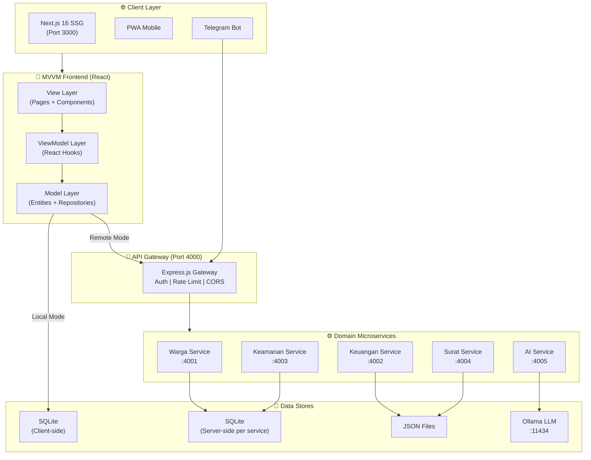
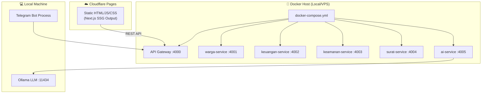
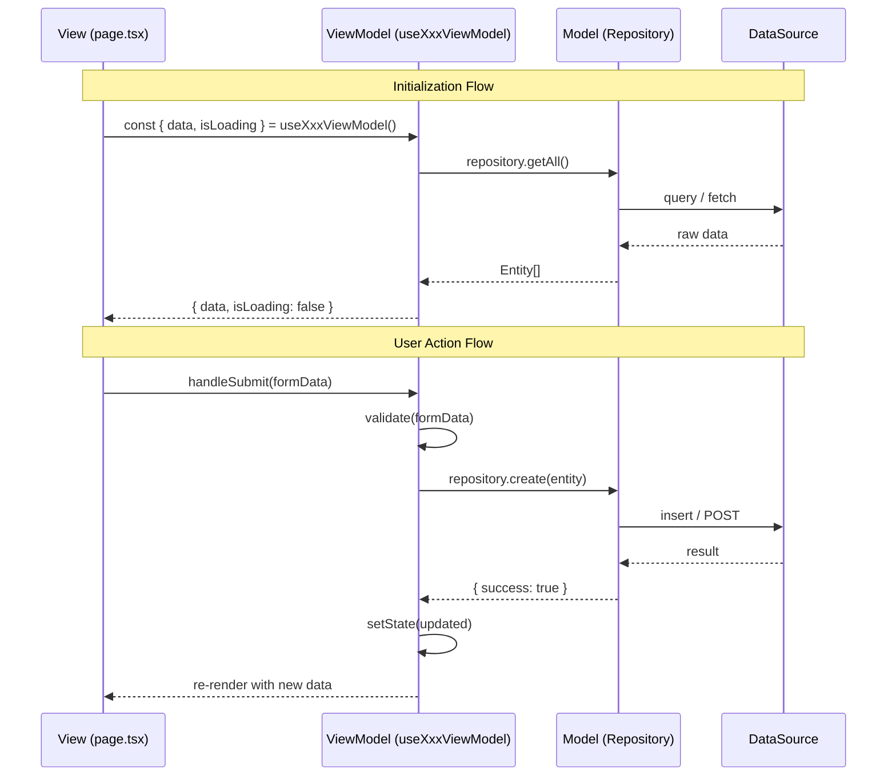
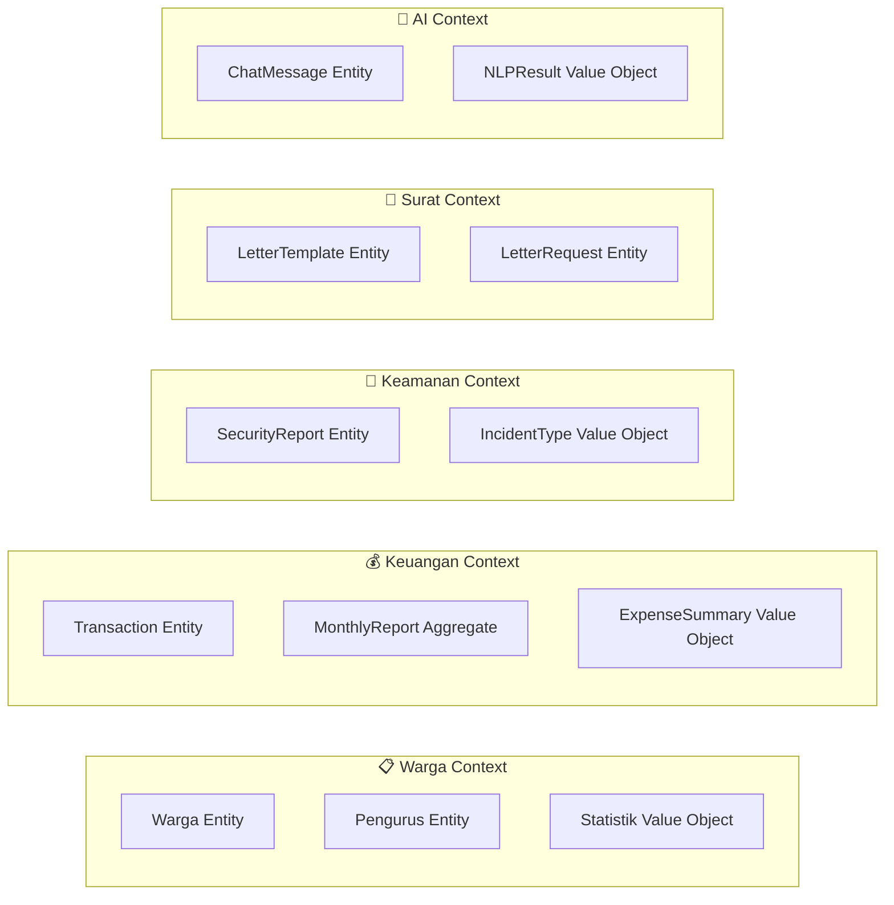
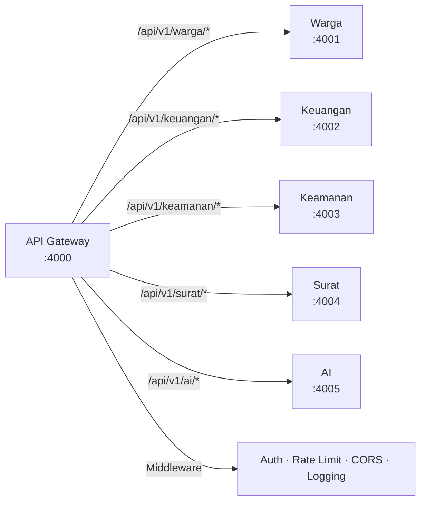
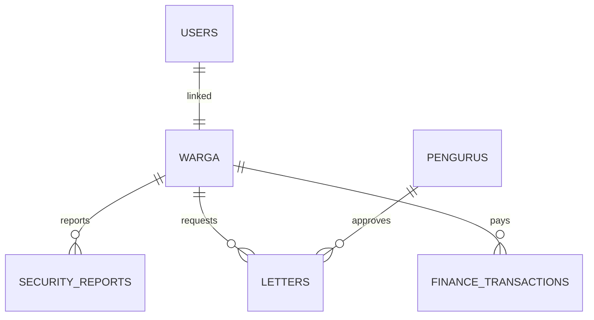

# 🎨 System Architecture Design (SAD)
## PRISMA — Platform Informasi & Sistem Manajemen RT 04
### SDLC Fase 2: System Design

**Versi Dokumen:** 1.1  
**Tanggal:** 10 April 2026 (Updated: Finalized MVVM Migration)
**Pattern:** MVVM + Microservices  

---

## 1. Arsitektur Keseluruhan

### 1.1 High-Level Architecture



### 1.2 Deployment Diagram



---

## 2. MVVM Pattern Detail

### 2.1 Layer Responsibilities

| Layer | Tanggung Jawab | Teknologi |
|-------|---------------|-----------|
| **View** | Rendering UI, user interaction, layout | React Components (TSX), Tailwind CSS, Framer Motion |
| **ViewModel** | State management, business logic, data transformation | React Hooks (useState, useCallback, useEffect) |
| **Model** | Domain entities, data validation, repository abstraction | TypeScript interfaces, Repository classes |

### 2.2 MVVM Data Binding



### 2.3 View Layer — Komponen Mapping

> **Catatan Migrasi Final:** Semua view (_page components_) kini mengambil data secara eksklusif menggunakan sistem hook `useXxxViewModel()` terkait. Pemanggilan `fetch('/api/...')` tradisional langsung ke endpoint internal Next.js telah dihapus seluruhnya untuk menjamin konsistensi _Single Source of Truth_.

| View (Page) | ViewModel Hook | Model Repository |
|-------------|---------------|-----------------|
| `/` (Dashboard) | `useDashboardViewModel` | WargaRepository, KeuanganRepository |
| `/layanan/administrasi` | `useWargaViewModel` | WargaRepository |
| `/keuangan/laporan` | `useKeuanganViewModel` | KeuanganRepository |
| `/keuangan/iuran` | `useKeuanganViewModel` | KeuanganRepository |
| `/surat/keamanan` | `useKeamananViewModel` | KeamananRepository |
| `/surat` | `useSuratViewModel` | SuratRepository |
| `/auth/login` | `useAuthViewModel` | UserRepository |
| Chatbot Widget | `useAIViewModel` | AIApiClient |

---

## 3. Microservices Design

### 3.1 Service Boundaries (Domain-Driven)



### 3.2 API Contract

#### Warga Service (Port 4001)

```
GET    /api/v1/warga           → List all warga
GET    /api/v1/warga/:id       → Get warga by ID
POST   /api/v1/warga           → Create new warga
PUT    /api/v1/warga/:id       → Update warga
DELETE /api/v1/warga/:id       → Delete warga
GET    /api/v1/warga/stats     → Get statistik
GET    /api/v1/pengurus        → List pengurus
```

#### Keuangan Service (Port 4002)

```
GET    /api/v1/keuangan/reports              → All monthly reports
GET    /api/v1/keuangan/reports/:bulan/:tahun → Specific month report
GET    /api/v1/keuangan/balance              → Current balance
GET    /api/v1/keuangan/summary              → Expense summary
POST   /api/v1/keuangan/transactions         → Add transaction
```

#### Keamanan Service (Port 4003)

```
GET    /api/v1/keamanan/reports    → List security reports
POST   /api/v1/keamanan/reports    → Submit new report
GET    /api/v1/keamanan/stats      → Security statistics
GET    /api/v1/keamanan/incidents  → Incident types
```

#### Surat Service (Port 4004)

```
GET    /api/v1/surat/templates           → List templates
GET    /api/v1/surat/templates/:id       → Get template detail
POST   /api/v1/surat/requests            → Submit letter request
GET    /api/v1/surat/download/:id/:fmt   → Download template file
```

#### AI Service (Port 4005)

```
POST   /api/v1/ai/chat           → Chat with Siaga AI
POST   /api/v1/ai/nlp/analyze    → Full NLP analysis
POST   /api/v1/ai/nlp/sentiment  → Sentiment analysis only
GET    /api/v1/ai/health         → Service health check
```

### 3.3 Inter-Service Communication



### 3.4 Service Registry & Discovery

Mode operasi sistem:

| Mode | Keterangan | ServiceRegistry Config |
|------|-----------|----------------------|
| **Local** | SQLite client-side, tanpa backend | `mode: 'local'` |
| **Remote** | Full microservices via API Gateway | `mode: 'remote'` |
| **Hybrid** | SQLite lokal + API untuk AI/NLP | `mode: 'hybrid'` |

---

## 4. Database Design

### 4.1 Database per Service

| Service | Database | Engine |
|---------|----------|--------|
| Warga | `warga.db` | SQLite (better-sqlite3) |
| Keuangan | `keuangan-data.json` | JSON File Store |
| Keamanan | `keamanan.db` | SQLite (better-sqlite3) |
| Surat | `surat-templates.json` | JSON File Store |
| AI | N/A (Ollama external) | — |
| Frontend | `prisma_demo.db` (client-side) | sql.js (WASM) |

### 4.2 ERD (tetap seperti existing)



---

## 5. Security Architecture

### 5.1 API Gateway Security

```
Request → CORS Check → Rate Limiter → Auth Token Verify → Route Proxy → Service
```

### 5.2 Security Layers

| Layer | Mekanisme |
|-------|-----------|
| Transport | HTTPS (Cloudflare SSL) |
| Gateway | CORS whitelist, Rate limit (100 req/min) |
| Auth | JWT / Session token validation |
| Input | sanitizeInput() — XSS, SQL injection prevention |
| Audit | logSecurityEvent() for all mutations |
| Data | PII masking (phone, email, NIK) |

---

## 6. Technology Stack per Service

| Service | Runtime | Framework | Dependencies |
|---------|---------|-----------|-------------|
| Gateway | Node.js 18+ | Express.js | http-proxy-middleware, cors, express-rate-limit |
| Warga | Node.js 18+ | Express.js | better-sqlite3, uuid |
| Keuangan | Node.js 18+ | Express.js | uuid |
| Keamanan | Node.js 18+ | Express.js | better-sqlite3, uuid |
| Surat | Node.js 18+ | Express.js | uuid |
| AI | Node.js 18+ | Express.js | node-fetch (Ollama client) |

---

*Dokumen ini adalah bagian dari SDLC Waterfall Phase 2 — System Design*
