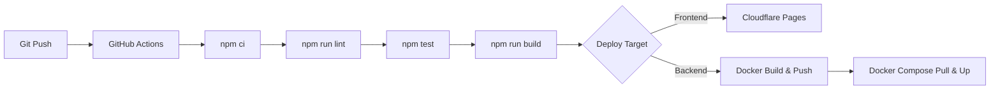

# 🚀 Deployment Guide
## PRISMA — Platform Informasi & Sistem Manajemen RT 04
### SDLC Fase 5: Deployment

**Versi Dokumen:** 1.0  
**Tanggal:** 10 April 2026  

---

## 1. Deployment Architecture

```
┌─────────────────────────────────────────────────────────┐
│                  DEPLOYMENT TOPOLOGY                     │
├──────────────────┬──────────────────────────────────────┤
│ Frontend (SSG)   │ Cloudflare Pages / Vercel            │
│ API Gateway      │ Docker Container (Port 4000)         │
│ Microservices    │ Docker Containers (Ports 4001-4005)  │
│ Telegram Bot     │ Persistent process (PM2/systemd)     │
│ Ollama LLM      │ Local machine (Port 11434)           │
└──────────────────┴──────────────────────────────────────┘
```

---

## 2. Frontend Deployment

### 2.1 Cloudflare Pages

```bash
# Build & deploy
npm run build
npx wrangler pages deploy out --project-name=prisma-rt04
```

### 2.2 Vercel

```bash
# Auto-deploy via git push (vercel.json configured)
git push origin main
```

---

## 3. Microservices Deployment (Docker)

### 3.1 Prerequisites

- Docker Engine 20+
- Docker Compose V2
- Node.js 18+ (for building)

### 3.2 Quick Start

```bash
# Start all services
docker-compose up -d

# Check all services running
docker-compose ps

# View logs
docker-compose logs -f gateway

# Stop all
docker-compose down
```

### 3.3 Individual Service

```bash
# Build specific service
docker-compose build warga-service

# Start specific service
docker-compose up -d warga-service

# Restart specific service
docker-compose restart keuangan-service
```

### 3.4 Health Check

```bash
# Gateway health
curl http://localhost:4000/health

# Individual service health
curl http://localhost:4001/health  # Warga
curl http://localhost:4002/health  # Keuangan
curl http://localhost:4003/health  # Keamanan
curl http://localhost:4004/health  # Surat
curl http://localhost:4005/health  # AI
```

---

## 4. Environment Configuration

### 4.1 Frontend (.env.local)

```bash
# Service mode: 'local' | 'remote' | 'hybrid'
NEXT_PUBLIC_SERVICE_MODE=local

# API Gateway URL (for remote/hybrid mode)
NEXT_PUBLIC_API_GATEWAY_URL=http://localhost:4000/api/v1
```

### 4.2 Microservices (.env)

```bash
# Common
NODE_ENV=production
LOG_LEVEL=info

# Gateway
GATEWAY_PORT=4000
CORS_ORIGINS=http://localhost:3000,https://prisma-rt04.pages.dev

# Service ports
WARGA_SERVICE_URL=http://warga-service:4001
KEUANGAN_SERVICE_URL=http://keuangan-service:4002
KEAMANAN_SERVICE_URL=http://keamanan-service:4003
SURAT_SERVICE_URL=http://surat-service:4004
AI_SERVICE_URL=http://ai-service:4005

# AI
OLLAMA_API_URL=http://host.docker.internal:11434/api/chat
OLLAMA_MODEL=llama3.2:1b
```

---

## 5. CI/CD Pipeline



---

## 6. Pre-Deploy Checklist

- [ ] All tests passing (`npm test`)
- [ ] Lint clean (`npm run lint`)
- [ ] Build successful (`npm run build`)
- [ ] Environment variables set on platform
- [ ] Docker images built and tested locally
- [ ] Health checks passing for all services
- [ ] Security headers configured
- [ ] PWA Service Worker built

---

*Dokumen ini adalah bagian dari SDLC Waterfall Phase 5 — Deployment*
